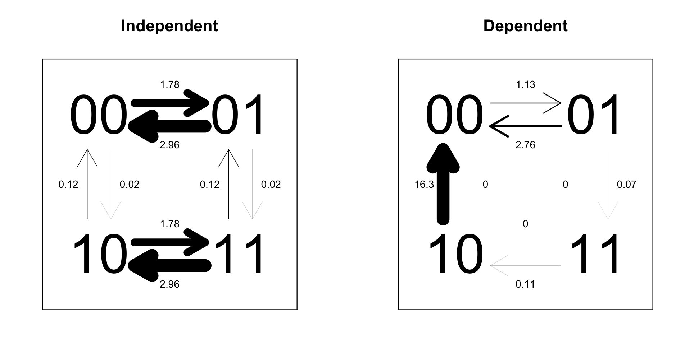
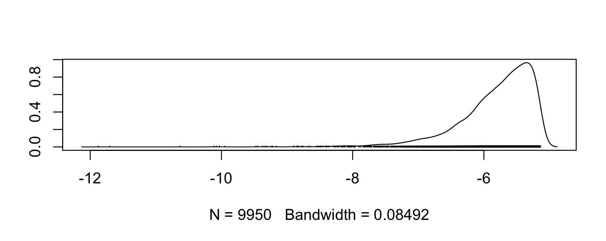
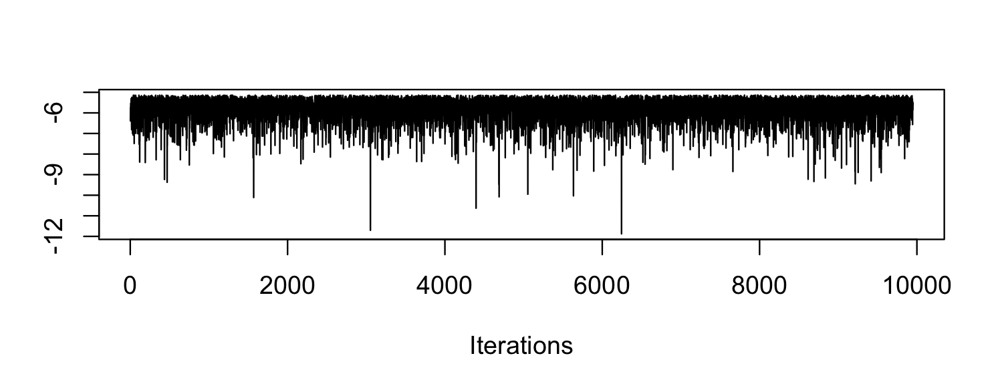
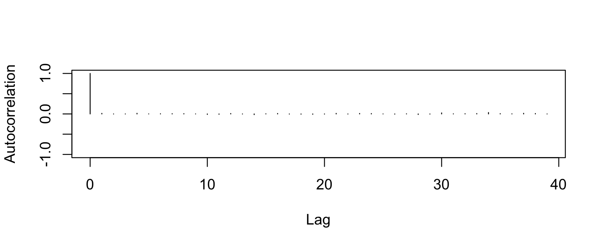

# btw examples

Demonstrates usage of `btw`. 

___

## Set-up

Install and load package.

```
library(devtools)
install_github("rgriff23/btw")
library(btw)
```

Set `.BayesTraitsPath` variable (this will likely be different on your machine).

```
.BayesTraitsPath <- "~/Desktop/GitHub/btw/BayesTraitsV2"
```

Load the primate data that comes with the package.

```
data(primates)
```

Now you're ready to use `btw`.

Some important formatting points that apply to all functions: 
- Phylogenies must be of class `phylo` or `multiPhylo`
- The first column of your data file must contain species names
- Species names must match exactly between the tree and data (but order doesn't matter)
- You cannot have species in your species names
- The only valid way to represent missing data is with a "-" character
- Discrete characters should be represented with characters or factors *(not integers!)* between 0 and 9
- If testing for correlated evolution in discrete characters, use 0 and 1 as the character states
- An integer with more than 1 digit is interpreted as ambiguous (e.g., "01") indicates that the species is equally likely to be in state "0" or "1"

## Using Discrete in Multistate mode

Multistate is used when you have data on a single categorical trait. An example of this sort of data is `primate.discrete1', which contains data on trait that takes 3 discrete values (0, 1, and 2). Viewing the data reveals one missing value (*Colobus_polykomos*) and one ambiguous value (*Hylobates_agilis*). More than two character states can be modeled, but keep in mind that the number of model parameters increases rapidly with the number of character states. Specifically, for *n* states there are *n*\**n* - *n* rate parameters, such that by the time you get to 4 states, 12 rates must be estimated!

### Symmetric vs. asymmetric model comparison

Let's fit a maximum likelihood model where we allow each of the 6 rates (0->1, 1->0, 1->2, 2->1, 0->2, 2->0) to be independent, and use a likelihood ratio test to compare it to a symmetric model where all rates must be equal to each other. 

```
asymmetric <- Discrete(primate.tree1, primate.discrete1, "ML")
symmetric <- Discrete(primate.tree1, primate.discrete1, "ML", res="q01")
lr.test(symmetric, asymmetric)
```

The likelihood ratio test is not significant, indicating that we should favor the simpler model. In this case, the symmetric model is simpler because it only estimates one parameter, while the asymmetric model estimates six. 

### Reversible jump hyper-prior model

Another way to get at the question of whether there is evidence for multiple rates of evolution among the 3 character states is to run a reversible jump model, which will sample across models in proportion to their likelihood and return a distribution of model structures. We will also take phylogenetic uncertainty into account by sampling across a block of 100 trees, `primate.tree100`.

```
multi.rj <- Discrete(primate.tree100, primate.discrete1, "Bayesian", rj="uniform -100 100", bi=10000, it=1000000, sa=1000)
```

We can use the function `rj.models` to get a quick summary of the models sampled in the reversible jump analysis.

```
rj.models(multi.rj)
```

Output indicates that an extremely large number of models were sampled in the posterior distribution (nearly 400!) and the top ten models represented an extremely small proportion of the total sample of models (the best model represented about 3.5% of all the models). This indicates that support for any one model over other possible models is weak, and in light of this, the simplest model should be chosen (i.e., all rates equal). 

### Fossilizing and reconstructing an ancestral state

Next, let's compare an unconstrained model to a model where we fossilize the ancestor of *Homo_sapiens* and *Hylobates_agilis* to be 2. And let's do it in a Bayesian framework.

```
fossilape <- Discrete(primate.tree1, primate.discrete1, "Bayesian", fo="2 Homo_sapiens Hylobates_agilis")
nofossil <- Discrete(primate.tree1, primate.discrete1, "Bayesian")
bf.test(fossilape, nofossil)
```
The Bayes factor is 2.6 and the unconstrained model is preferred. We can also estimate the probabilities of different ancestral states for the *Homo_sapiens*/*Hylobates_agilis* ancestor. Let's use maximum likelihood this time (the default setting).

```
reconstruct <- Discrete(primate.tree1, primate.discrete1, mrca="Homo_sapiens Hylobates_agilis")
```

Results indicate that there is only a 30% chance that the *Homo_sapiens*/*Hylobates_agilis* ancestor was in state 2, which is consistent with our finding that the model where we fossilized that ancestor at 2 was significantly worse than the unconstrained model.

## Using Discrete in Discrete mode 

Discrete can be used to test for correlated evolution between a pair of binary characters. An example of this data is `primate.discrete2`, which contains a pair of binary traits. 

### Independent vs. dependent evolution test

Let's do the significance test for correlated (i.e., dependent) evolution for the two traits in maximum likelihood mode. 

```
nocorrD <- Discrete(primate.tree1, primate.discrete2)
corrD <- Discrete(primate.tree1, primate.discrete2, dependent=TRUE)
lr.test(corrD, nocorrD)
```

The difference is not significant, indicating that the simpler model (no correlation) should be preferred. The output from these models can be a little confusing, but the `plot.discrete` function allows visualization of the results. 

```
layout(matrix(1:2,1,2))
plot.discrete(nocorrD, main="Independent")
plot.discrete(corrD, main="Dependent")
```



In this analysis, each *pair* of states for the two traits is treated as a separate state (00, 01, 10, 11). The independent model forces some pairs of rate parameters to be identical, because the idea is that transition rates for each trait should be the same, indepent of what state the other trait is in (this leads to 4 overall parameters). By contrast, the dependent model assumes that transition rates for each trait depend on the state of the other trait, such that different rates need to be estimated (leading to 8 overall parameters). Due to the different constraints imposed on the two models, their transition rate matrices look very different, but as the likelihood ratio test demonstrates, the difference is not significant.

## Using Continuous 

The `Continuous` function can be used to compare models of evolution for one or more continuous traits. The format for the data files is the same as for discrete traits.

### Phylogenetic signal test

Continuous supports the estimation of several parameters that correspond to different models of evolution. Perhaps the most widely used of these is lambda, the phylogenetic signal parameter developed by Mark Pagel (1999). Let's test the hypothesis that the maximum likelihood estimate of lambda is significantly different from 0 for a single continuous trait. 

```
lambda0 <- Continuous(primate.tree1, primate.continuous1, lambda=0)
lambdaML <- Continuous(primate.tree1, primate.continuous1, lambda="ML")
lr.test(lambdaML, lambda0)
```

The p-value is not significant, so there is no evidence that lambda is different from 0 (which corresponds to no phylogenetic signal in the data).

### Correlated evolution test

We can test for a significant correlation between pairs of continuous traits. The `tc` parameter fixes the correlation between two traits to be 0, and this can be used as a null model to test for a significant correlation.

```
nocorrC <- Continuous(primate.tree1, primate.continuous2, tc=TRUE)
corrC <- Continuous(primate.tree1, primate.continuous2)
lr.test(nocorrC, corrC)
```

The p-value is not significant, so there is no evidence for a correlation between these traits.

### Regression model

Continuous can also be used to fit regression models with 1 or more predictor variables. The first variable in the dataframe is automatically treated as the response variable. Let's fit a regression model with two predictor variables.

```
glm1 <- Continuous(primate.tree1, primate.continuous3, regression=TRUE)
glm1
```

We can compare the standard errors of regression parameters to their estimated values to assess whether they are significant. In this model, the estimate of Beta.2 is -0.5 with a standard error of 0.73, while the estimate of Beta.3 is 1.24 with a standard error of 0.57. Thus, only Beta.3 is significantly different from 0 (because 0 lies outside the interval 1.24 +/- 0.57).

## MCMC diagnostics

A convenient thing about running BayesTraits with `btw` is that the output from Bayesian MCMC analyses are basically ready to be analyzed with the R package `coda` for doing MCMC diagnostics. Here, I provide some examples of how `coda` can be used to do health assessments for MCMC chains. First, let's make some data (this won't be pretty... the point is just to see how it works).

```
coda.demo <- Discrete(primate.tree100, primate.discrete1, "Bayesian", it=1000000)
```

Now load the `coda` package (if it isn't already installed, then install it!).

```
library(coda)
```

In one easy step, we can prepare the MCMC output for analysis in `coda`. The key is that `coda` functions work on objects of class `mcmc`, so we need to convert columns from our dataframe into `mcmc` objects before using `coda` plotting functions. We can do this by wrapping the variable we want to plot with the `mcmc` function. 

Here is a density plot for the likelihood.

```
densplot(mcmc(coda.demo$Lh))
```



Here is a trace plot for the likelihood.

```
traceplot(mcmc(coda.demo$Lh))
```



Here is an autocorrelation plot for the likelihood.

```
autocorr.plot(mcmc(coda.demo$Lh))
```



This all just goes to say that `btw` makes it easy for you to use the tools provided by `coda` to do MCMC diagnostics. Check out the `coda` documentation for more info!

## References

Pagel, M. (1999). "Inferring the historical patterns of biological evolution." Nature 401(6756): 877-884.

___


